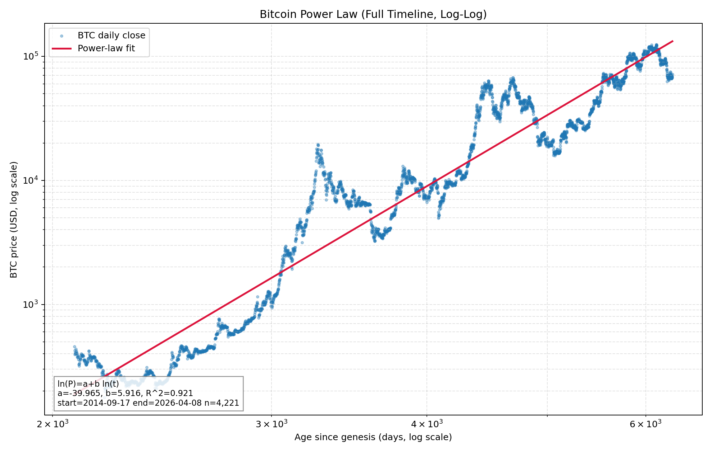

# BTC Power Law Chart (Full Timeline to Present)
Date: 2026-04-07

## Executive Summary
I generated a full-timeline BTC power-law chart on log-log axes using daily closes through 2026-04-08. The fitted relation is `ln(P) = a + b ln(t)` with `b=5.916`, `a=-39.965`, and `R^2=0.921`, indicating a strong historical log-log linear relationship in this sample. The chart covers all available Yahoo BTC daily data (`n=4,221`) with age measured from Bitcoin genesis (2009-01-03). This provides the requested visual for evaluating whether BTC price action appears approximately linear in log-log space.

## Data Sources
- Price series: Yahoo Finance `BTC-USD` daily close via `yfinance`.
- Time window used: 2014-09-17 to 2026-04-08 (full available history in this vendor feed).
- Time anchor for power-law age term: Bitcoin genesis date `2009-01-03`.
- Supporting artifact:
- `agents/roy/research/data/2026-04-07-btc-power-law-plot-data.csv`

## Methodology
- Constructed age variable `t` as days since 2009-01-03.
- Fit OLS on logs:
- `ln(price_t) = a + b * ln(age_days_t)`.
- Generated chart with:
- Scatter of observed BTC closes.
- Fitted power-law curve (`exp(a + b ln(t))`).
- Log scale on both axes.

## Results
Estimated parameters and fit quality:

| Metric | Value |
|---|---:|
| Exponent `b` | 5.9158 |
| Intercept `a` | -39.9649 |
| `R^2` | 0.9207 |
| Observations | 4,221 |
| Start date | 2014-09-17 |
| End date | 2026-04-08 |

Chart output:
- `agents/roy/research/charts/2026-04-07-btc-power-law-loglog.png`

## Implications
- The visual and fit statistics support the interpretation that BTC has exhibited a strong long-run log-log scaling structure over this sample.
- This chart is suitable as a structural context layer (valuation/trend envelope framing), not a standalone trading trigger.
- Cross-reference with Chris macro regime work remains necessary for timing and risk throttling decisions.

## Confidence Level
**Medium-High.**
- High confidence in reproducibility of the chart/fitted coefficients.
- Medium confidence in forward-usefulness because a high in-sample fit does not guarantee regime-stable predictive power.

## Open Questions
- Do we want confidence bands (e.g., residual quantiles) overlaid on this chart for production dashboard use?
- Should we add a linear-time (semi-log) comparison panel to show why log-log is preferred for this framing?
- Should we standardize this as a daily-refresh chart artifact for the Strategy #1 reporting stack?
